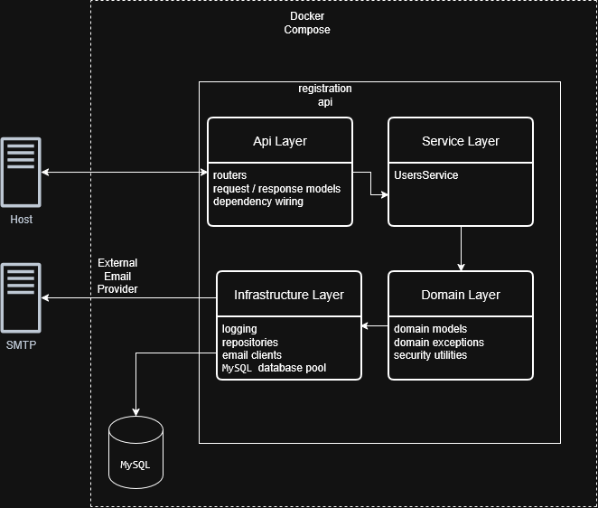

# User Registration API

Simple user registration API built with FastAPI, MySQL, and asyncio.

Features:
- Clean layered architecture
- Explicit dependency injection
- Application factory (no side effects on import)
- Transactional service layer
- Full test suite (unit, API, integration)
- MySQL integration tests using Testcontainers


## Application Lifecycle

1. create_app(settings) is called
2. FastAPI application is created
3. Database instance is attached to app.state
4. On startup:
   - Database pool is initialized
   - Database schema/migrations are applied
5. Requests are handled
6. On shutdown:
   - Database pool is gracefully closed

## Architecture



## Email (SMTP) Handling

For this project, the email provider is treated as a **third-party service**.

### Current implementation

Emails are **mocked** and **printed to the application logs** instead of being sent.

This choice was made to:
- Keep the system fully self-contained
- Avoid external dependencies
- Make activation codes visible during development and tests

Example log output:

```bash
| 2025-12-15 17:29:29,181 [INFO] app.infrastructure.email.console_client: [EMAIL MOCK] to=auser@example.com subject=Activate your account body=Your activation code is: 0571 (valid for 1 minute)
```

## Configuration

Configuration is handled via Pydantic BaseSettings and environment variables.

Required environment variables:
- MYSQL_HOST
- MYSQL_PORT
- MYSQL_USER
- MYSQL_PASSWORD
- MYSQL_DATABASE
- ENVIRONMENT (production | test | integration)


## Running the Application

Prerequisites:
- Docker
- Docker Compose

Command:

```bash
docker compose up
```

This will start the API and its dependencies locally.

---
## How to Run Tests

Prerequisites:
- Docker
- Python 3.12

Commands:

```bash
docker compose -f docker-compose.test.yml up --build --abort-on-container-exit
```

Once the application is running, the interactive API documentation is available at:

- Swagger UI: http://localhost:8000/docs
- OpenAPI schema: http://localhost:8000/openapi.json


## Design Decisions

Why an application factory?
- Avoid side effects at import time
- Enable multiple app instances for tests
- Explicit lifecycle management

Why Testcontainers?
- Real database behavior
- No shared state
- Fully reproducible test environment

Why explicit dependency injection?
- Easier testing
- Clear ownership of resources
- No hidden globals

